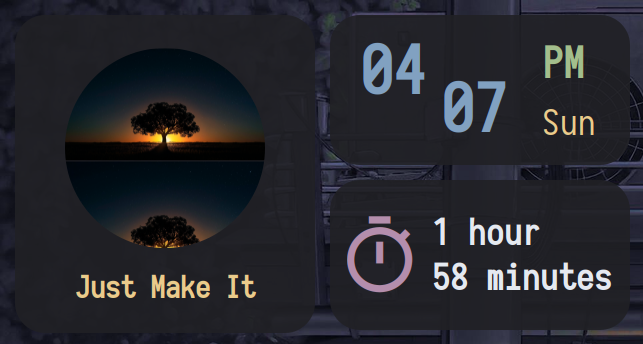

# `eww` Widgets

A set of minimalistic [eww](https://github.com/elkowar/eww)(Elkowars Wacky Widgets), based and edited from [adi1090x/widgets](https://github.com/adi1090x/widgets).

Highly appreciate their great works.

## Introduction
The Clock, Uptime, Profile widgets:


## Installation
1. install [eww](https://github.com/elkowar/eww)(Elkowars Wacky Widgets)
    - follow [eww documentation](https://elkowar.github.io/eww/) for installation
    - reference [Dharmx's EWW Powermenu Tutorial](https://dharmx.is-a.dev/eww-powermenu/) to understand more about eww and obtain hints for installation and configuration troubleshooting
2. clone this Git repo to `~/.config/eww`
3. launch the widgets with below command:
```shell
cd ~/.config/eww
./launch.sh
```
